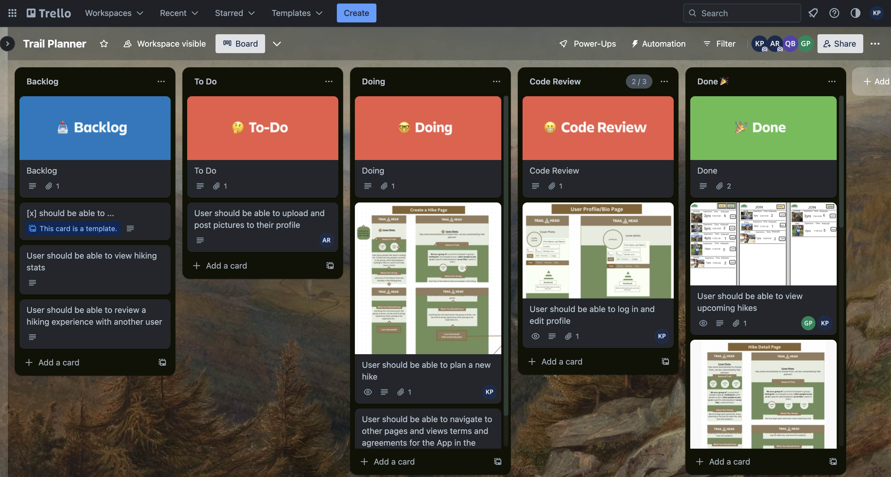
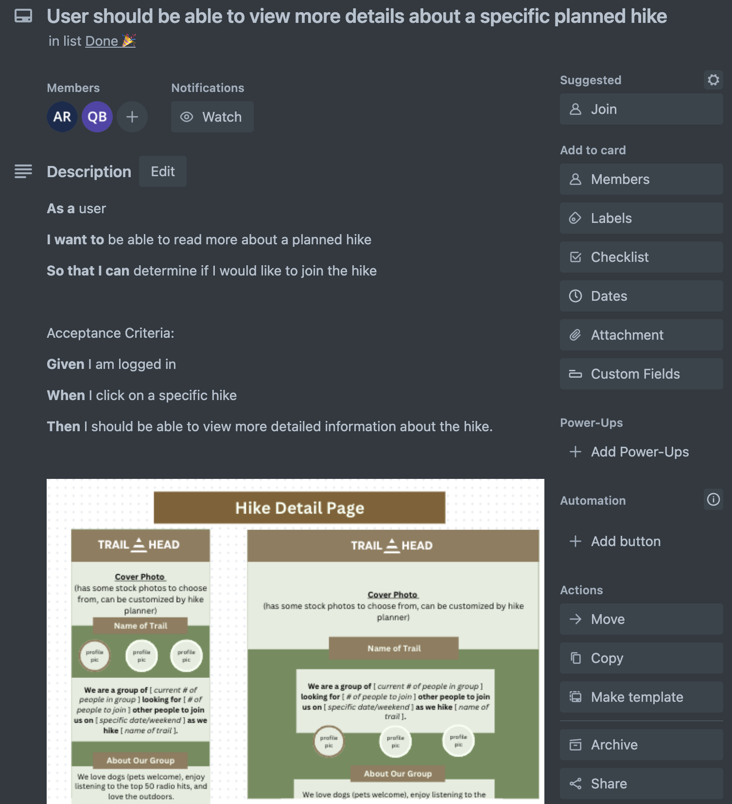
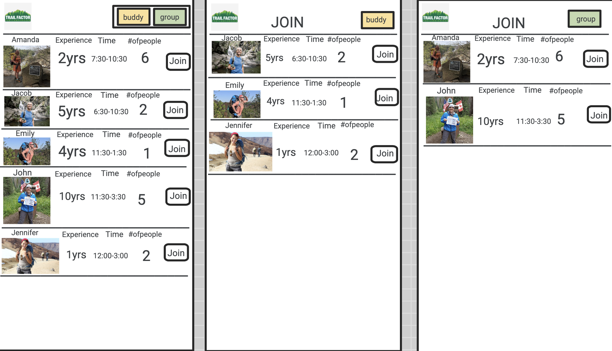
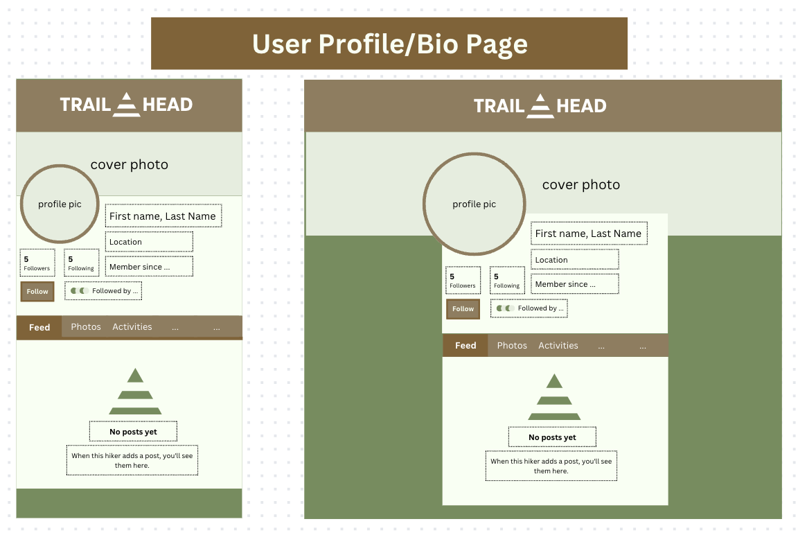

# Trail Ahead
Trail Ahead is a full-stack web application created with the goal of helping hikers find hikers. This front-end client is built with [React](https://react.dev/) functional components, styled with vanilla CSS, and incorporates an animation library to improve the user experience. It is accompanied by the [Trail Ahead API](https://github.com/kevncrypting/Trail-Ahead-Back-End).

## Description

Trail Ahead brings together hikers of all experience levels. Whether you are looking for a hiking companion or a hiking group, Trail Ahead has something for you. 

After account creation and login, the hike list is available to be viewed, which provides users with a central space to find all available planned hikes/hiking groups in the area. Users can create/plan a new hike from this page, or click into a specific hike to find out more details. 

Trail Ahead aims to solve the problem of connecting new hikers with seasoned ones, and also help experienced groups find new connections.

>Future Feature: There will be filters on the Hike List page to sort by group size, experience level, and planned hike date

>Future Feature: There will be a chat/messaging feature for real-time communication with other users, enabled with the use of web sockets

## API

Before running the front-end client, make sure to fully read through the instructions on the [Trail Ahead API](https://github.com/kevncrypting/Trail-Ahead-Back-End) and start the back-end server first. All necessary instructions/documentation are provided in the README, including the routes/endpoints available to be used. 

## Running the App Locally

1. Clone the repository to your local machine: 
    `git clone https://github.com/DQuaya/Trail-Ahead-Front-End.git`

2. Navigate to the cloned repository: 
    `cd the-brew-buddy`

3. Install the dependencies: 
    `npm install`

4. Start the application: 
    `npm run preview`

The application will start on http://localhost:3001.

## Deployed Application
You can access the deployed application at: https://trail-ahead.onrender.com/

## Application Flow and Wireframes

The application has the following main screens:

- About: Shows information about the authors and the purpose of the project.

- Hike List: Shows a list of all hikes pulled from the Trail Ahead API, as well as a button to create a new hike. When a specific hike is viewed, the subsequent screen displays all related information to that specific hike. 

- Profile: Shows a user's profile with associated personal information (optional, user is prompted for this information during sign up), including:

>Future Feature: Users will be able to follow other users (and be notified of any new planned hikes by the user)
>Future Feature: Users will be able to post hike pictures to personal feed
>Future Feature: Users will be able to review hike experiences led by other hikers (and star rating will be displayed on any future planned hikes)
>Future Feature: Users will be able to accumulate badges/achievements (milestone-based, e.g. join 5 hikes, lead a hike for the first time, explore 10 different trails)

### Trello:

Using Trello, our group created user stories and practiced using the Kanban method of project management to visualize our workflow. We identified each problem that we wanted to solve with a specific user in mind, and built each feature with that solution in mind. We also made use of Test-Driven Development and the red-green-refactor cycle while creating our components. 

### Wire Frames:

Using pen-and-paper, Jamboard, and Canva, our group also developed several high-fidelity wireframes to accompany the user stories that showed how we thought the app should look and where specific features/components lived on the page. We built and styled the application based on these wireframes.

Here are a few sample wireframes that our group used as guidance to build and styling the application.

### Development Team
DonQuaya Brown - [LinkedIn](https://www.linkedin.com/in/donquayabrown/) and [GitHub](https://github.com/DQuaya)
Thanuseng Kevin Prachith - [LinkedIn](https://www.linkedin.com/in/tkprachith/) and [GitHub](https://github.com/kevncrypting)
Aaliyah Russell - [LinkedIn](https://www.linkedin.com/in/aaliyah-russell-80900a1b5/) and [GitHub](https://github.com/Azrussell)
Gerald Pinkins - [LinkedIn](https://www.linkedin.com/in/gerald-pinkins/) and [GitHub](https://github.com/GeraldPinkinsJr)